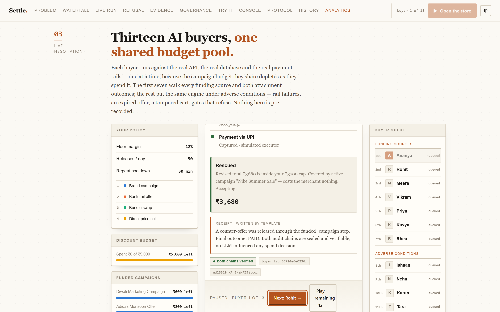
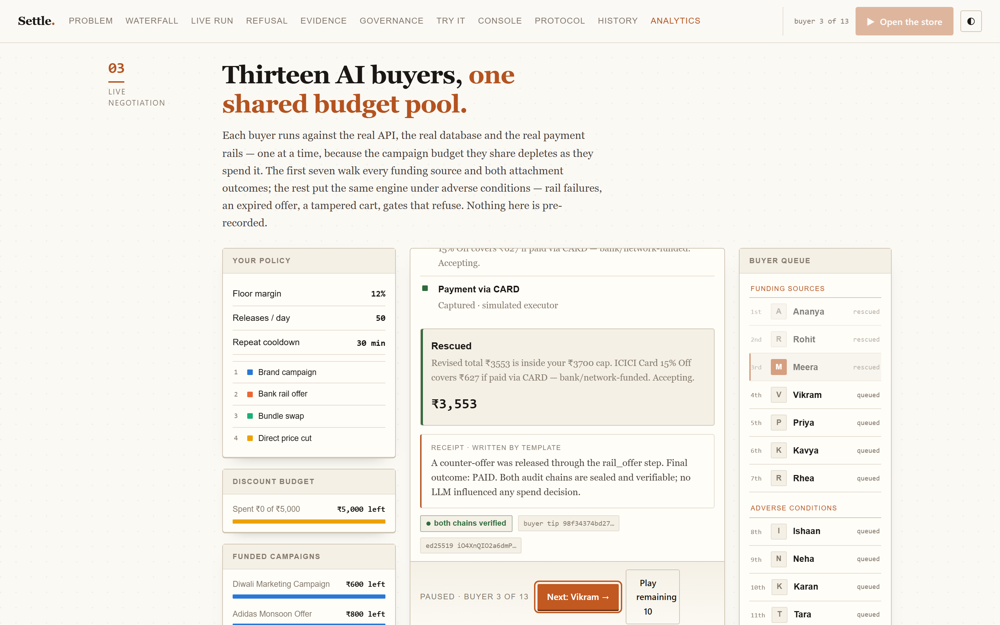
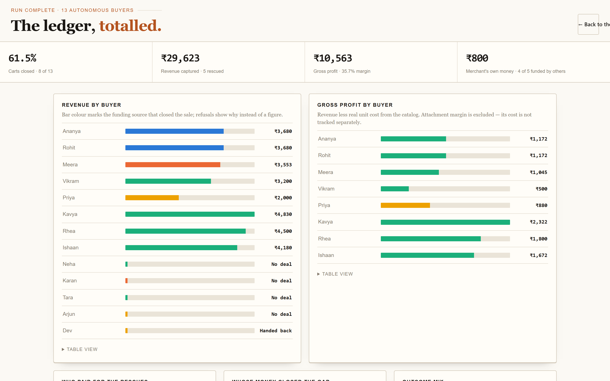
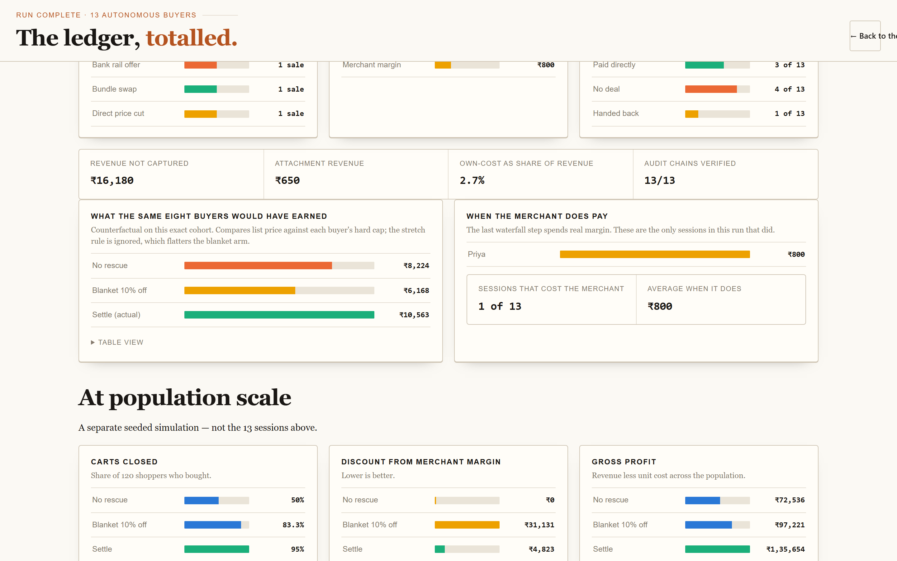
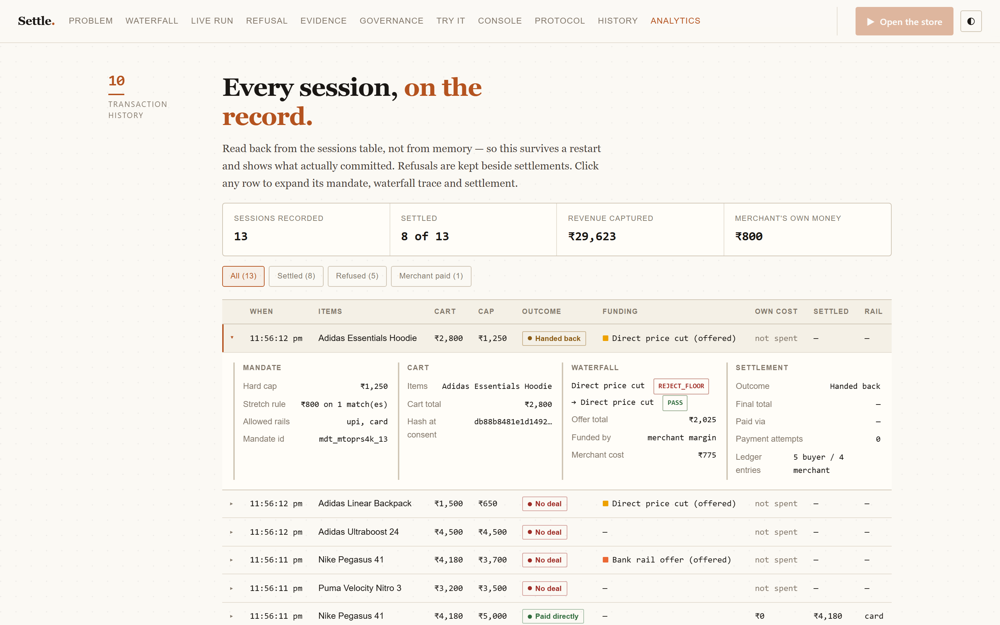
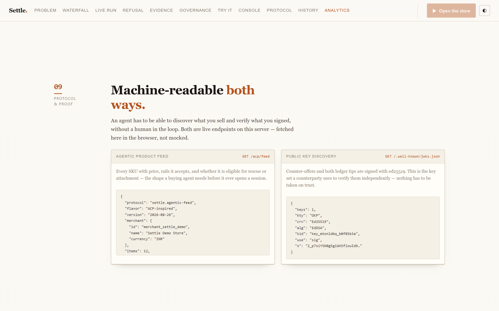

# Settle — Agent-Ready Merchant Checkout Engine

> **Razorpay AI Buildathon · Track 1: AI Growth & Agentic Commerce**

When an AI buyer hits a merchant's checkout and the cart exceeds their spending mandate, most agentic journeys die right there. **Settle is the merchant-side engine that rescues that sale** — negotiating within pre-declared buyer rules, funding relief in the cheapest possible order, refusing any discount that breaks merchant guardrails, and sealing every decision into a tamper-evident, signed audit trail. When the cart is *under* budget, Settle grows the basket instead — one criteria-matched attachment, accepted only via the buyer's own declared extras rule.

> On 120 synthetic shoppers at a realistic 20% floor margin: blanket-10%-off converts 83.3% while burning ₹31,131 of merchant money.
> **Settle converts 95% while spending ₹4,823 of merchant money (−84.5%)** — plus ₹918 of attached upsell revenue. Brand-funded campaigns, bank-funded rail offers and margin-neutral swaps are tried before a single rupee of direct discount, and campaign budgets deplete like real budgets do.

---

## The AI Thesis, Stated Up Front

**The negotiation and settlement path is 100% deterministic and auditable by design. LLMs are confined to natural-language interpretation — parsing intent, narrating decisions — never to spend authorization.** Every rupee crosses two pure-function gates (`buyer-gate.ts`, `merchant-gate.ts`) that an LLM cannot influence. Trustworthy money-movement beats a flashy autonomous agent in a payments track.

---

## Razorpay Integration — What's Real vs Simulated

| Component | Status |
|-----------|--------|
| Order creation | **Real** — `POST https://api.razorpay.com/v1/orders` via zero-dep `fetch` + Basic-auth test keys (`src/razorpay/client.ts`). Accepted settlements create real test-mode orders visible in the dashboard; `order_id`s are recorded in the audit ledgers. |
| Payment capture | **Real** — embedded checkout URL (`/v1/checkout/embedded`) + webhook handlers for `payment.captured`, `payment.failed`, `order.paid`. Test cards (`success@razorpay` / `failure@razorpay`) work end-to-end. |
| Offers/campaigns registry | **Simulated by necessity** — third-party bank offers can't be created via public sandbox APIs. Campaign budgets are finite caller-owned state that depletes across sessions. |

Set `RAZORPAY_KEY_ID` / `RAZORPAY_KEY_SECRET` in `.env` to activate; without keys everything runs on the deterministic simulator. Verify with `npm run rzp:integration`.

---

## Why Now

NPCI's UAP and the ACP/AP2/x402 race make agent-to-agent commerce the open problem of the year; Razorpay's in-app agentic pilots are already live. Protocols standardize *transport and consent* — nobody ships the *commercial intelligence* layer for agent checkouts. That's the gap Settle occupies. Every Settle artifact maps onto a named protocol counterpart — see `docs/protocol-map.md`.

---

## See It Running

The landing page at `/` is a single narrative: the claim, the mechanism, a live run,
the economics, and the audit trail. Every figure on it is computed — none are hardcoded.

### The pitch and the live policy


The panel on the right is not a mockup — it is the merchant's real policy, read from
Postgres: floor margin, daily discount budget, repeat-buyer cooldown, and the funding
order with what each step costs.

### The funding waterfall


Four sources, tried in a fixed order, side by side so the order itself is the argument.
Only the last one spends merchant margin.

### 13 AI buyers against one shared budget



Buyers 1–7 walk every funding source and both attachment outcomes; 8–13 put the same
engine under adverse conditions. They run **one at a time**, because the campaign budget
they share depletes as they spend it. The run is presenter-paced — each buyer holds at
its outcome until you advance, or hand the rest to the clock.

### The beat the whole demo turns on



Ananya and Rohit both take the Nike campaign, draining it to ₹0. Meera arrives with an
**identical instruction and an identical cart** — and the waterfall falls through:

> *Brand campaign — skipped. Nike Summer Sale would have covered this, but the budget is spent.*

She still closes, funded by a bank rail offer, still at ₹0 merchant cost. Note the
receipt and the ed25519 ledger-tip signature beneath the outcome.

### Analytics



Revenue by buyer coloured by funding source, gross profit priced against **real unit
cost** from the catalog, and refusals shown as refusals rather than gaps.

### The counterfactual



The same cohort under three policies. A blanket 10% off frequently earns *less than
doing nothing*, because it converts more but gives away margin on carts that would have
closed anyway. Also isolated here: the sessions where the merchant actually paid.

*(The counterfactual compares list price against each buyer's hard cap and ignores the
stretch rule, which flatters the blanket arm — the real gap is wider.)*

### Transaction history



Read back from the `sessions` table, so it survives a restart. Settlements and refusals
kept side by side; any row expands into its mandate, cart hash, waterfall trace and
settlement. A refused offer is marked *(offered)* and *not spent* — an offer the buyer
declined never counts against merchant margin.

### Protocol surfaces



Two live endpoints, fetched in the browser: `/acp/feed` is the agentic product feed a
buying agent reads before opening a session, and `/.well-known/jwks.json` is the ed25519
key set a counterparty uses to verify a signed counter-offer independently.

---

## Surfaces

| Route | What it is |
|---|---|
| `/` | **Landing + control room.** The narrative above, with the live 13-buyer run, analytics, history, try-it and the scenario suite. |
| `/demo` | Same page, explicit path. |
| `/console` | **Merchant console.** The original operator view — rescue feed, KPIs, policy overrides, fault injection, dual-ledger trace viewer. |
| `/buyer` | **Buyer agent.** Speak or type an intent, watch the mandate get parsed into visible rules, follow the negotiation, and get an itemised bill explaining why every line is there. |
| `/acp/feed` | Agentic product feed (ACP-inspired). |
| `/.well-known/jwks.json` | Public key set for verifying signed offers and ledger tips. |
| `/api/history` · `/api/history/detail` | Session ledger, and full detail for one session. |

---

## Architecture

```
Human ──NL──▶ Buyer Agent ──mandate──▶ Session ──gap──▶ Waterfall ──counter──▶ Buyer Gate
        (parser.ts)  │                                              │                │
                      ▼                                              ▼                ▼
                BUYER LEDGER ◀── hash chain + ed25519 tips ──▶ MERCHANT GATE    accept/pause/abort
                                                                     │
                                                        Razorpay Orders API (real, test mode)
```

The waterfall spends merchant money last:

1. **Brand campaign** (brand-funded → costs ₹0)
2. **Rail offer** (bank/network-funded → costs ₹0)
3. **Bundle swap** (margin-neutral equivalent SKU)
4. **Direct price cut** (own money — minimum sufficient, floor-margin gated)

Guardrails on every release: floor margin %, daily discount budget, per-user cooldown.
Partial-rescue round: if full-gap relief is unprofitable, a half-gap offer lets pre-authorised buyer flex cover the rest.

**Growth loop (within-cap carts):** the suggester pre-filters the catalog by category adjacency *and* the buyer's declared `attachmentCriteria` ("extras only from Nike" → only Nike items are ever offered), ranks by affinity + margin, and offers at most one attachment. Acceptance requires the dedicated extras rule or consented affinity — never the stretch rule — and triggers an audited cart re-consent before payment.

---

## The Trust Spine (The Track Bar)

| Track requirement | Where it lives |
|---|---|
| Every money action explainable | Buyer-gate traces + narrated rounds; trace viewer shows both ledgers side-by-side |
| Bounded | Mandate hard cap + declared flex rule + pre-declared attachment criteria; max-3 payment rails; hunt-time budget; finite campaign budgets; daily discount budget |
| Gated | `buyer-gate.ts` & `merchant-gate.ts` pure functions; LLM never computes money |
| Audit trail | Dual append-only hash chains + per-session ed25519-signed tips, verified live in the console |
| Signed artifacts | Every counter-offer is an ed25519-signed `settle.counter_offer.v1` artifact bound to mandate id + cart hash; badges in both UIs |
| Adversarial proof | Red-team corpus — prompt injection, cap inflation, unbounded stretch, extras smuggling, junk rails — runs the real gates: **0 violations** (`npm run redteam`); the LLM intent parser sits behind a schema-validation gate with deterministic fallback |
| Failure handled gracefully ×4 | Offer expiry mid-round · all-rails declined · cart drift after consent · consent revoked — all E2E-proven in Chromium (`npm run e2e`) |

---

## Quickstart

```bash
# 1. Install dependencies
npm install

# 2. Start PostgreSQL (Docker)
docker run -d --name settle-postgres \
  -e POSTGRES_PASSWORD=postgres -e POSTGRES_DB=settle \
  -p 5432:5432 postgres:16-alpine

# 3. Configure environment
cp .env.example .env
# Edit .env with your DATABASE_URL and optional RAZORPAY keys

# 4. Run migrations & seed
npm run db:migrate
npm run db:seed

# 5. Type-check & test
npm run typecheck && npm test

# 6. Run demo (120-shopper A/B report)
npm run demo                      # one rescue story from both audit ledgers
npm run metrics                   # 120-shopper A/B report → docs/metrics-report.json
npm run redteam                   # adversarial buyers attack the gates → docs/redteam-report.json

# 7. Start server
#    http://localhost:8787/         landing + live control room
#    http://localhost:8787/console  merchant console
#    http://localhost:8787/buyer    buyer agent
npm run dev
```

Optional: set `LLM_API_KEY` (+ optional `LLM_BASE_URL`, `LLM_MODEL`, see `.env.example`) to enable the LLM intent parser; without it the deterministic parser drives everything.

---

## Results

`docs/metrics-report.json` (seed 42, 120 shoppers, reproducible) carries four views — read together, they are the honesty story:

- **Primary (floor 20%)**: no-rescue 50% · flat-10% 83.3% @ ₹31,131 own-cost · **Settle 95% @ ₹4,823 own-cost + ₹918 attached upsell** (+11.7pp conversion, −84.5% own-cost vs flat discounting). Conversion stays high because external funding (finite campaigns + rail offers) covers most gaps.
- **Ceiling (floor 12%)**: identical shape; retained as an explicitly-labelled ceiling run, not the claim.
- **Floor sweep 12→30%** with full waterfall: barely moves — floors don't bind when relief is externally funded.
- **Own-money-only sweep**: when campaigns/rail offers are disabled, Settle still closes 68.3% at the hard daily budget cap (~₹5,000) vs flat-10%'s 83.3% at ₹31,131 — **~6× cheaper discounting for somewhat lower conversion**, and degradation is graceful, not catastrophic.

---

## Honest Limitations

- Catalog/offers are simulated (test-mode scope); Razorpay live offers APIs aren't public in test mode.
- Payment capture uses embedded checkout (real API) but test cards only; production would need full KYC'd merchant onboarding.
- Audit chains are tamper-*evident* with ed25519-signed per-session tips; production key management (HSM, rotation ceremonies) is documented future work.
- Cross-sell is capped at one attachment per session by design — growth never overrides the mandate.
- No Redis-backed rate limiting or horizontal scaling yet (single-process Node HTTP server).

---

## Stack

TypeScript (NodeNext), zero runtime dependencies, Node built-in HTTP, vanilla console UI, Playwright E2E, tsx toolchain. PostgreSQL for persistence. ed25519 via WebCrypto.

---

## Project Structure

```
src/
├── audit/           # Hash-chained ledgers + ed25519 signing
├── buyer/           # Parser, agent decision, cross-sell evaluation, memory
├── core/            # Pure-function gates (buyer-gate, merchant-gate), money/hash utils
├── db/              # PostgreSQL client, migrations, seed
├── merchant/        # Waterfall engine, cross-sell suggester, data
├── narrate/         # Human-readable receipt builder
├── negotiation/     # Session orchestration
├── payments/        # Razorpay client, checkout, webhook, executor
├── razorpay/        # Zero-dep Razorpay REST client
├── server/          # HTTP server, auth (JWT + key rotation), DB service, routes
├── types/           # Shared TypeScript types
└── metrics/         # A/B harness + red-team runner
```

---

## Documentation

| File | What it covers |
|---|---|
| `ARCHITECTURE.md` | System design and evaluation guide |
| `docs/demo-video.md` | 5-minute demo flow, shot list, spoken script, pre-record checklist |
| `docs/submission-answers.md` | What the project solves, and the build obstacles |
| `docs/protocol-map.md` | How each Settle artifact maps to ACP / AP2 / x402 counterparts |
| `docs/security-audit.md` | Pre-submission security pass |
| `docs/metrics-report.json` | Generated by `npm run metrics` — the 120-shopper A/B run |
| `docs/redteam-report.json` | Generated by `npm run redteam` — adversarial corpus results |

---

## Running the Demo

The live run leaves real state behind — campaign budgets deplete, the daily discount
budget accumulates, and sessions persist. **Reset before presenting**, or the campaign
fall-through and the merchant-pays price cut will not demonstrate:

```sql
DELETE FROM release_ledger WHERE merchant_id = merchant_settle_demo;
UPDATE campaigns SET remaining_budget_paise = total_budget_paise WHERE merchant_id = merchant_settle_demo;
UPDATE inventory_reservations SET status = released WHERE status = pending;
UPDATE inventory SET reserved_qty = 0 WHERE merchant_id = merchant_settle_demo;
```

The page warns you on load if it detects leftover state. Without Razorpay keys set,
payments run on the deterministic simulator and everything else behaves identically.

---

## License

ISC